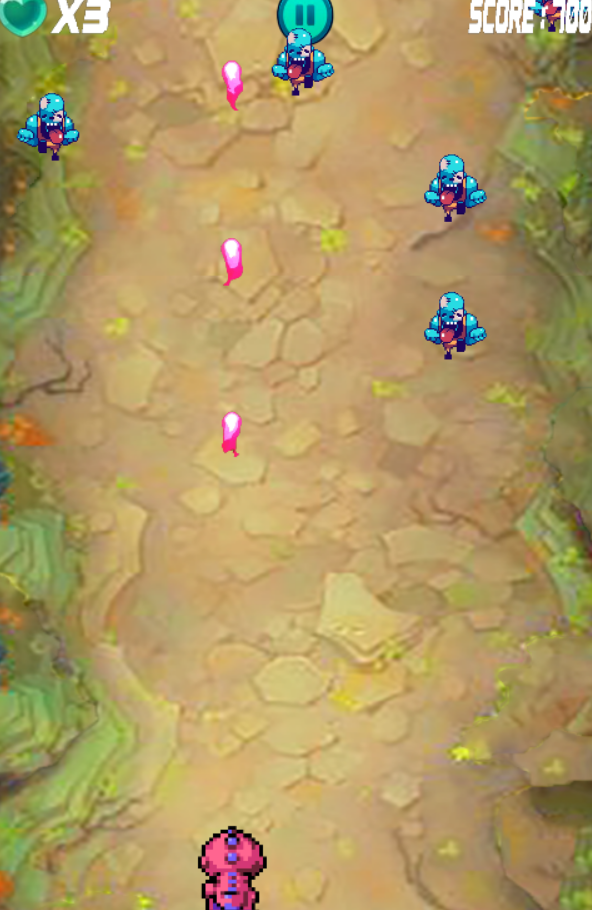
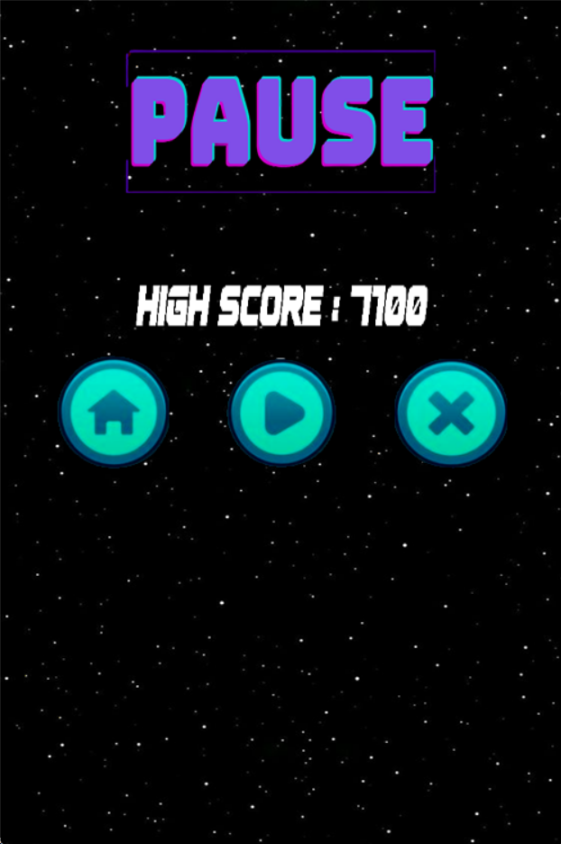

# ***Dino Run***
# **1.Giới thiệu game**
* "Dino Run" là một tựa game hành động đầy kịch tính và hấp dẫn, nơi người chơi sẽ điều khiển một chú khủng long dũng cảm trong một cuộc phiêu lưu đầy thử thách. Trên hành trình của mình, chú khủng long sẽ phải đối mặt với vô số quái vật nguy hiểm xuất hiện từ khắp nơi.

* Nhiệm vụ của người chơi là điều khiển khủng long né tránh hoặc tiêu diệt những con quái vật bằng cách bắn chúng. Với khả năng di chuyển linh hoạt và kỹ năng chiến đấu mạnh mẽ, khủng long của bạn sẽ phải vượt qua những màn chơi đầy cạm bẫy và thách thức.
# **2.Menu Game**
Dưới đây là menu của trò chơi "Dino Run":

  

Menu chính của game Dino Run được thiết kế đơn giản, thân thiện với người dùng và hấp dẫn về mặt hình ảnh, với nền chủ đề không gian và các nút bấm nổi bật. Menu cung cấp cho người chơi các tùy chọn sau:
* **PLAY GAME**:  Nút này cho phép người chơi bắt đầu một trò chơi mới. Khi nhấp vào, người chơi sẽ được đưa trực tiếp vào cuộc chơi, nơi họ điều khiển chú khủng long để né tránh hoặc bắn các kẻ thù.
* **EXIT**: Nút này thoát khỏi trò chơi. Nó cung cấp một cách nhanh chóng và đơn giản để đóng ứng dụng.

* **HOW TO PLAY**:Nút này cung cấp hướng dẫn cách chơi game. Đây là hướng dẫn cần thiết cho những người chơi mới để hiểu cách điều khiển khủng long, cách bắn.

**Hiển Thị Điểm Cao**:
Phần trên của menu hiển thị nổi bật HIGH SCORE với giá trị mặc định là 000. Phần này theo dõi điểm cao nhất mà người chơi đạt được.

# **3. Các nhân vật ,items và enemy của Game**
- **Nhân vật** : Chú khủng long màu đỏ ( Dino )

 
 -  **Items**:

| Tên | Hình ảnh | Chức năng |
|:----------|:----------:|:----------|
| Heart |  | Ăn vào giúp người chơi tăng thêm 1 mạng ( Tối đa 3 mạng ) |
| Red Orb |   | Giúp nhân vật bắn ra 1 tia lửa có sát thương cao và có thể xóa bỏ các viên đạn mà quái vật bắn ra |
| Purple Orb |  | Giúp nhân vật bắn ra 1 tia tím có sát thương lớn , tiêu diệt mọi thứ trên đường đi của nó |
| Yellow Orb |  | Giúp nhân vật bắn ra 1 tia vàng có tốc độ cực nhanh |

- **Enemy**

| Tên | Hình ảnh |Tính năng |
|:----------|:----------:|:----------|
| Zombie |  | Là những con Zombie di chuyển tiến về phía dưới , thường xuất hiện theo đợt , nó sẽ di chuyển nhanh hơn khi level càng cao. Khi chạm vào zombie, nó sẽ biến mất nhưng nhân vật cũng sẽ mất một mạng. |
| Monster |  | Là những con Monster di chuyển tiến về phía dưới và bắn ra các tia đạn , nó sẽ di chuyển nhanh hơn khi level càng cao. Khi chạm vào monster hay tia đạn của nó nhân vật cũng sẽ mất một mạng. |

# **4. Cách Chơi game**

Trong **Dino Run**, bạn sẽ điều khiển một con khủng long với nhiệm vụ sống sót và tiêu diệt các quái vật xuất hiện trên đường đi. Dưới đây là các bước cơ bản để chơi:

  

1. **Di Chuyển**: Sử dụng các phím `W`, `A`, `S`, `D` để điều khiển khủng long di chuyển theo các hướng lên, xuống, trái, phải để tránh các chướng ngại vật và quái vật.

2. **Tấn Công**: Nhấn chuột trái để bắn đạn và tiêu diệt các quái vật trên đường. Hãy chú ý tới số lượng đạn bạn còn!

  

3. **Tránh Quái Vật**:
   - **Zombie**: Những con quái vật này di chuyển chậm nhưng có sức bền cao. Tránh va chạm trực tiếp với chúng vì mỗi lần va chạm sẽ làm bạn mất một mạng.
   - **Monster**: Những con quái vật này di chuyển nhanh và có khả năng tấn công từ xa. Chúng nguy hiểm hơn vì vừa phải tránh chúng, vừa phải né đạn của chúng. Mỗi lần va chạm hoặc bị chúng bắn trúng sẽ làm bạn mất một mạng.

4. **Mức Độ Khó**: Khi bạn tiến xa hơn trong trò chơi, các quái vật sẽ di chuyển nhanh hơn, tăng độ khó và yêu cầu kỹ năng né tránh cũng như tấn công chính xác hơn.

5. **Tạm Dừng**: Bạn có thể tạm dừng trò chơi bất kỳ lúc nào để nghỉ ngơi hoặc suy nghĩ chiến thuật.

  

6. **Mục Tiêu**: Sống sót càng lâu càng tốt và đạt điểm số cao nhất có thể bằng cách tiêu diệt càng nhiều quái vật càng tốt mà không để mất hết số mạng của bạn.

# **5. Source code**